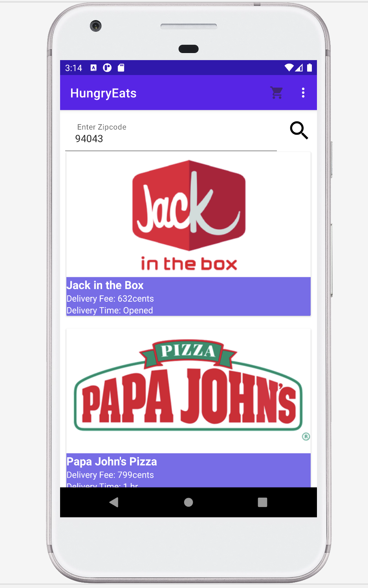
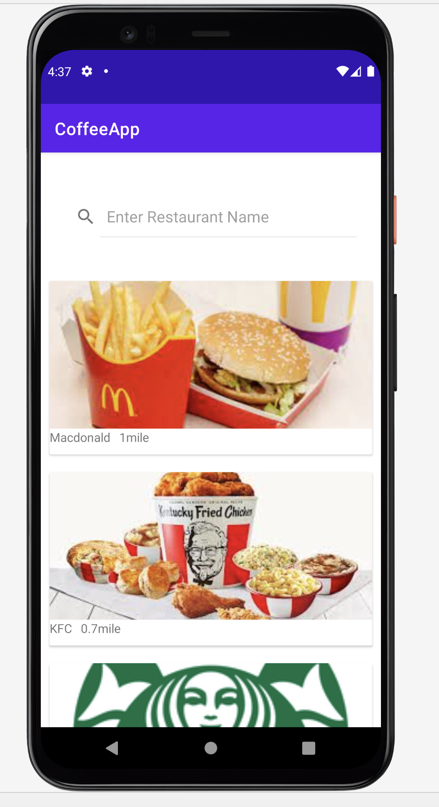

## HungryEats
Is an android app for online food delivery, making it it easy to deliver food at your doorstep

## [Detail Documentation of the Assignment](https://github.com/prideven/HungryEats/blob/Assignment2_Topic6/CMPE%20277_Assignment2.docx)

## Topic6:
 
 I have choosen topic6, to fecth backend API using RetroFit and livedata. 

## API to fecth List of Restaurants
Will display the list of restaurants avalible to deliever. 

&nbsp; &nbsp;

## API To fetch Restaurant Details for the Restaurant selcted
Will display the list of menu for the restaurant selected.

&nbsp; &nbsp;

## Demo Video
https://youtu.be/SW3WTwDXbjY
