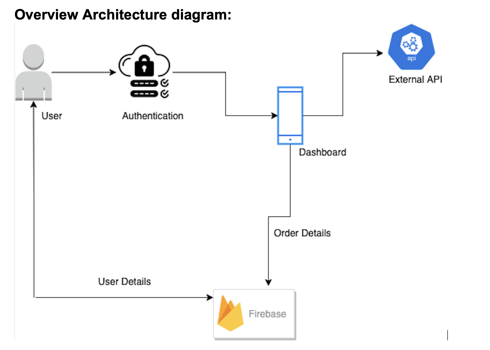
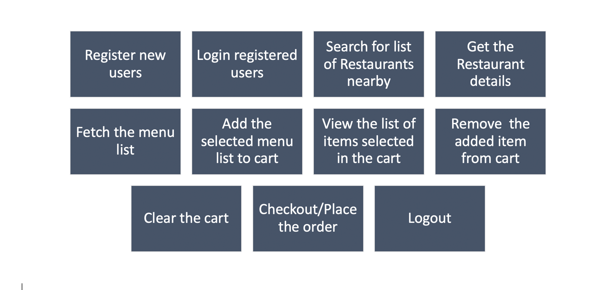
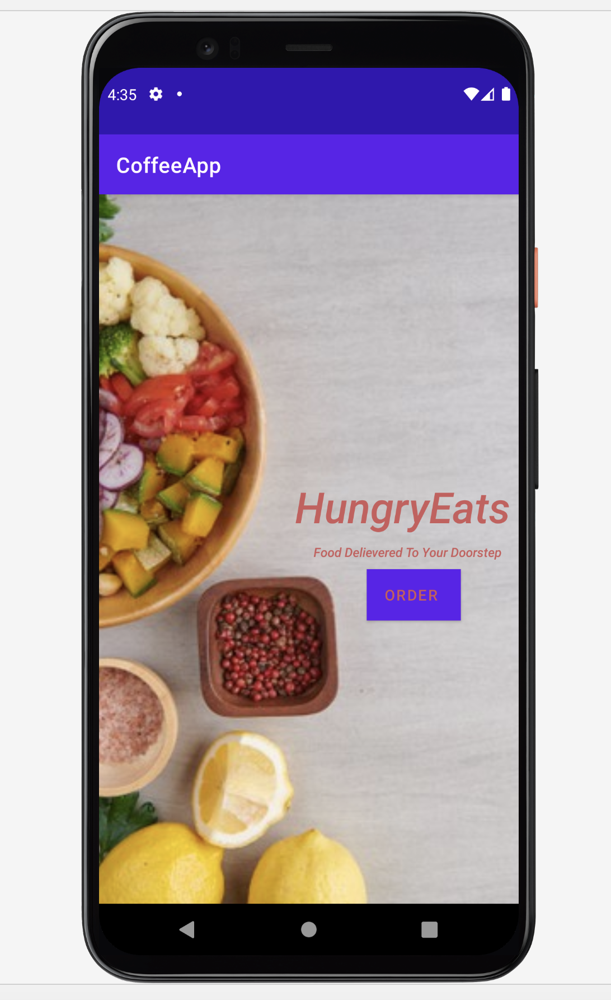
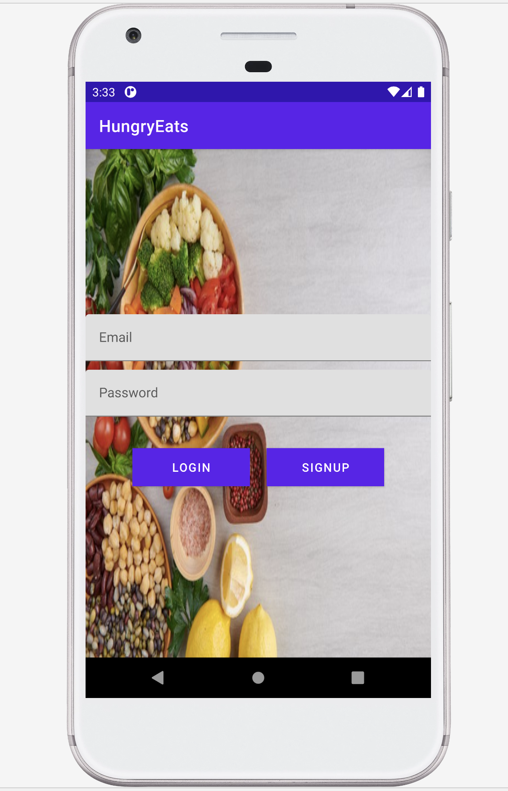
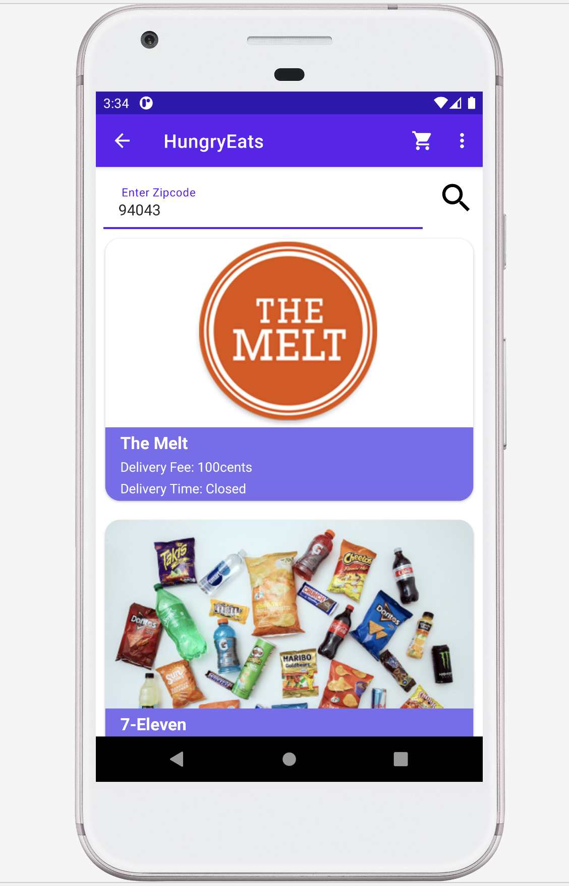
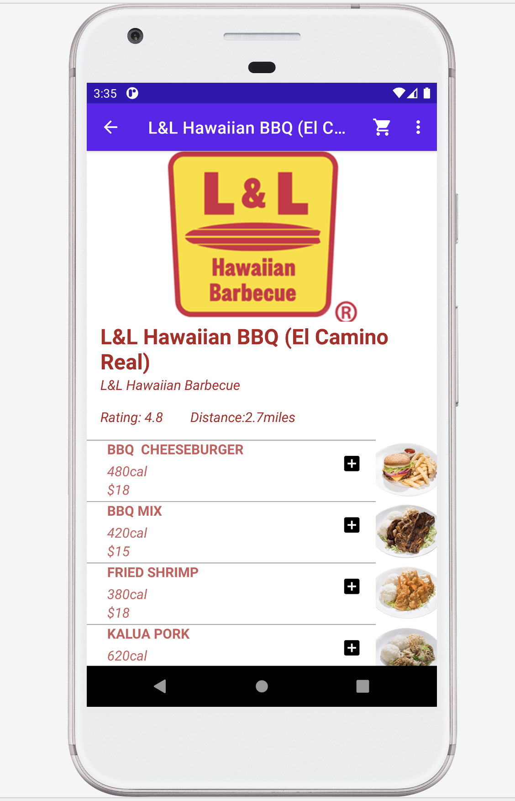
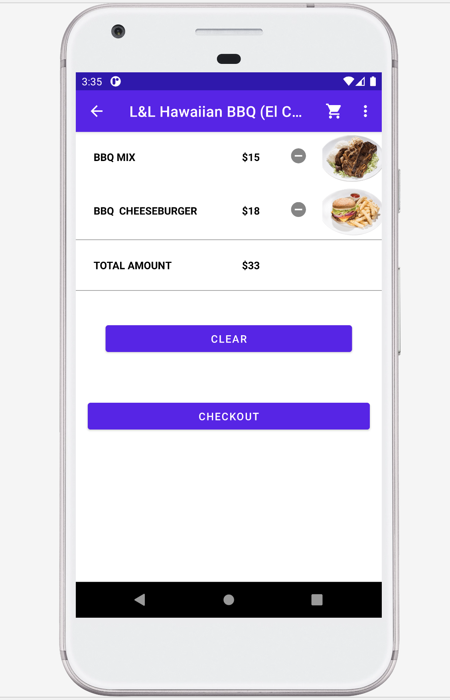
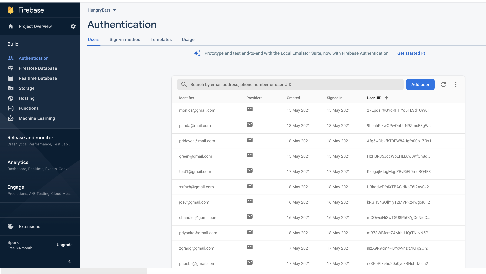
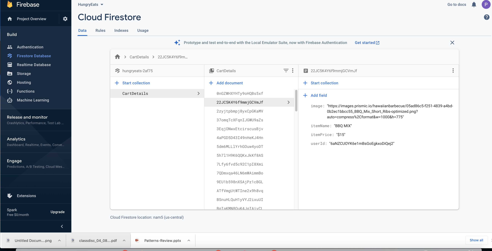

## HungryEats
Is an Android application that provides a platform for online delivery of food at your doorstep. Pandemic had increased the demand for food delivery service and many restaurants are now offering home delivery. 
Due to pandemic food delivery applications has proven to be more important for both customers as well as business owners. For customers it’s one of the easiest way to satisfy the food cravings while staying safe at home and for many business owners it helps the business to survive by providing online delivery option.

                           

## Demo Video
(https://www.youtube.com/watch?v=Z59qJvDN-Yk&ab_channel=PriyankaDevendran)

## HungryEats Icon

&nbsp; &nbsp;

         

## Overview Architecture diagram

## Functionalities implemented

## Details of the Functionality included:

### The application consists of the below:

### -> The LaunchActivity

The LaucnhActivity is the home page for HungryEats application and is the first screen that is loaded once the user launches the application, the user can click on order button to continue with the app.

### -> LoginAndRegisterActivity: 

The LoginAndRegisterActivity helps user to register the application if not already registered and login for registered users. The user details are stored in the google firebase to authorize and authenticate the users.

### ->	MainActivity:

The MainAcitvity has a tool bar with cart icon and a menu bar for the users to logout, also the back navigation is enabled for the users.

MainActivity has 3 fragments:

#### * Restaurant Fragment

To fetch the list of restaurants from the zipCode provided by the user. The backend API call excepts only latitude and longitude as parameters , therefore google API call is done to convert the user provided zipCode to latitude and longitude to display the list of Restaurants present. The user can view all the list of Restaurants and select them to view the restaurant details.

#### *	MenuFragment
 
The Menufragment is used to fetch the details of the restaurant that is selected. The backend API is used to fetch the menu lists by passing the selected restaurant id as the parameter. 
The user can view the restaurant details such as the ratings and also view the menu offered by the Restaurant and add any of the selected items to the cart.

#### * CartFragment

The CartFragment are stored using the google firebase, once the user selected the cart icon present on the toolbar the user can view all the list of items added in the cart. The user can remove any of the items added , can clear the entire cart or proceed to checkout to the place the order.

Android Architecture Diagram

&nbsp; &nbsp;

                                  
 ## Login/SignUp
Is the first page displayed for the users logging in.

&nbsp; &nbsp;

## List of Restaurants
Will display the list of nearby restaurants from the pincode provided. 

&nbsp; &nbsp;

## Menu List
Will display the list of menu for the restaurant selected.

&nbsp; &nbsp;

                          
                                
## Cart List
Will display the list of cart items added by the user.

&nbsp; &nbsp;

                                
                                                             
## Screenshot of Firebase Configuration
                               
### For storing User details
                             
 
 
 ### For storing cart details 
 
                               

