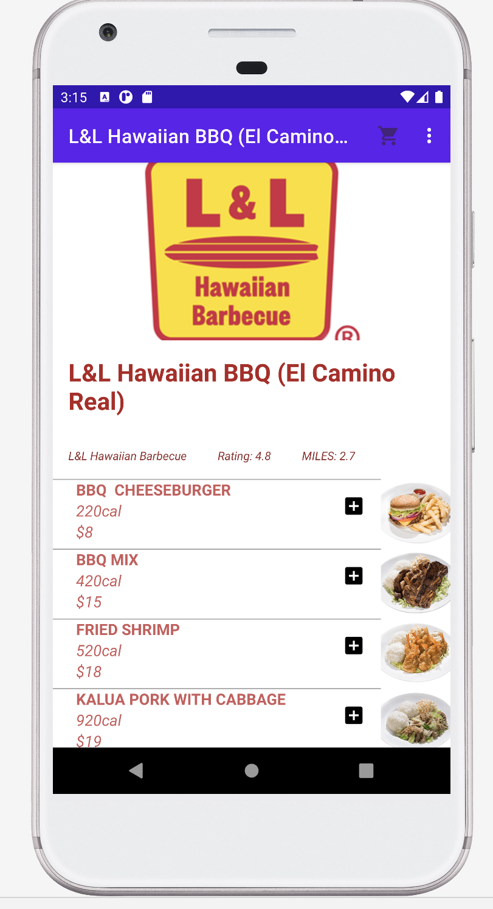

## HungryEats
Is an android app for online food delivery, making it it easy to deliver food at your doorstep

## Frameworks & Technologies
Activity,Recycler View,Constraint layout,Linear Layout

## App Specifications

App wil have 3 activites:
The welcome
The Restaurant List P
The menu list for the selected restaurant

##Welcome
Is the first page displayed for the users logging in.

&nbsp; &nbsp;

##List of Restaurants
Will display the list of restaurants avalible to deliever. 

&nbsp; &nbsp;

##Menu List
Will display the list of menu for the restaurant selected.

&nbsp; &nbsp;

